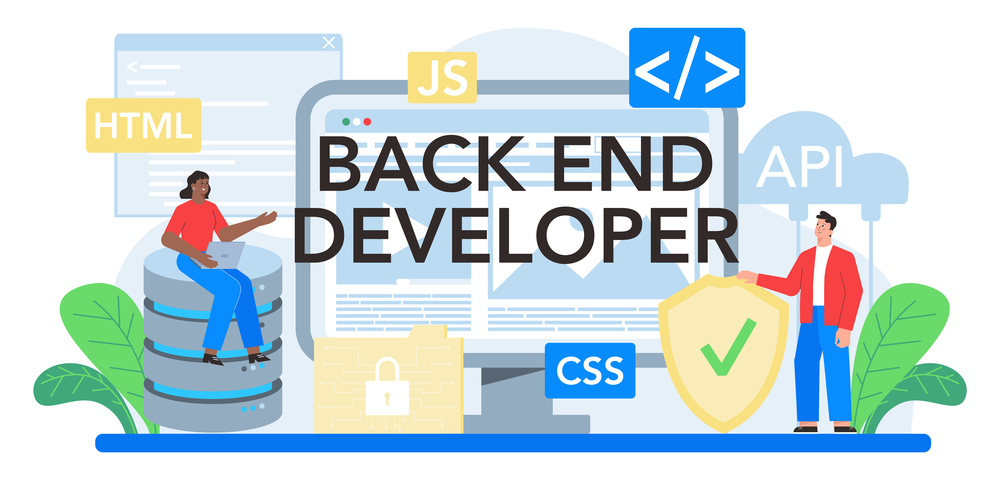

<h1>
Hi 👋, I'm <strong>Franklin AHONON (Franki1607)</strong>
</h1>

  

## Tech Stack

##### Languages

  
  
  
  
  
  
  
  
  
  

##### Databases

  
  
  
  

  

##### Frameworks and Libraries

  
  
  
  
  
  
  
  
  
  

I have worked with several programming languages such as C, Java, PHP, Python, and JavaScript 🔥 and I have also experimented with frameworks such as Laravel, Symfony, Django and Angular 🚀

You will find here my personal and professional projects, so feel free to explore them 🔍

If you want to talk about projects or just chat over a virtual coffee 🍵, don't hesitate to reach out to me!

<!--**🚧 Under development: **
- Project X 
- Project Y
-->

**🛠 Technologies I use:**
- **Languages:** Dart, C, Java, Java Swing, PHP, Python, JavaScript, TypeScript, HTML, CSS, Arduino 
- **Frameworks:** Flutter, Laravel, Symfony, Django, Angular, NodeJs,  Express.js
- **Databases:** MongoDB, PostgreSQL, MySQL, SQLite
- **Tools:** Git, VSCode, PyCharm, Android Studio, Docker, Poetry

<!--
**Franki1607/Franki1607** is a ✨ _special_ ✨ repository because its `README.md` (this file) appears on your GitHub profile.

Here are some ideas to get you started:

- 🔭 I’m currently working on ...
- 🌱 I’m currently learning ...
- 👯 I’m looking to collaborate on ...
- 🤔 I’m looking for help with ...
- 💬 Ask me about ...
- 📫 How to reach me: ...
- 😄 Pronouns: ...
- ⚡ Fun fact: ...
-->
